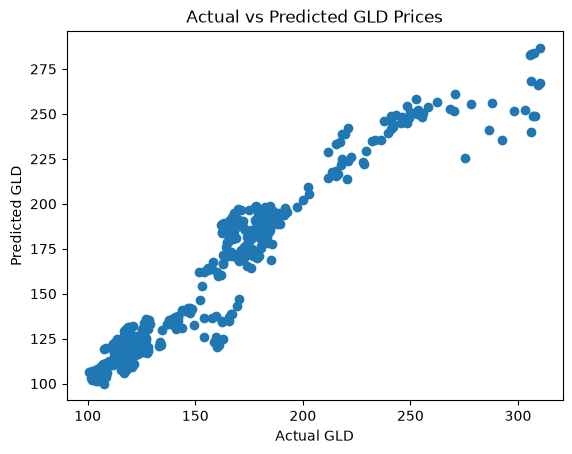

# GOLD PRICE ANALYSIS
[](https://github.com/Mark7569/IDS706-Assignment-2/actions/workflows/test.yml)

## Project Overview
This project analyzes gold price data from 2015 to 2025 with Python, Pandas, and polars. The dataset also contains several financial market variables, including the S&P 500 (SPX), oil (USO), silver (SLV), and the EUR/USD exchange rate. The project explores the dataset through basic data inspection, filtering, grouping, visualization, and a simple linear regression model.

## Files
- "gold_price_analysis.py"
- "gold_price_visualization.png"
- "pandas_vs_polars.py"
- "rust_vs_python_intro.ipynb"

## Dataset
The dataset was downloaded from Kaggle. It contains six variables and 2666 observations in total:
- Date
- SPX
- GLD
- USO
- SLV
- EUR/USD

## Setup
Install the required Python packages:

```bash
pip install pandas scikit-learn matplotlib kagglehub pytest
```

Run the analysis with:

```bash
python gold_price_analysis.py
```

## Testing
The project includes unit tests for data loading, preprocessing, filtering, yearly averages calculation, and linear regression modeling. An edge case is included to test filtering when no GLD prices are above 200. An entire system test is also included to validate the complete analysis workflow.

Run the tests with:

```bash
python -m pytest tests/ -v
```
## Testing Results


## Continuous Integration
GitHub Actions automatically runs the test suite whenever changes are pushed to the repository or submitted through a pull request. The workflow has completed successfully multiple times.


## Data Inspection
In data inspection, 'head()', 'info()', and 'describe()' were used to inspect and summarize the data. At the same time, missing values and duplicate were checked.

## Filtering and Grouping
The Date column was converted to a datetime format and a Year variable was created.
I filtered the dataset to examine observations where GLD was above 200. 
I also grouped the data by Year and calculated the average GLD price for each year.

The yearly averages show an increase in GLD prices over the sample period, with a particularly noticeable increase in the later years.

## Machine Learning
Linear regression was chose to predict GLD prices.
Inputs:
- SPX
- USO
- SLV
- EUR/USD

Outputs:
- GLD

I split the dataset into 80% training data and 20% testing data. The linear regression model achieved an R-squared value of approximately 0.921 on the test set.

## Visualization
I created a scatter plot comparing the actual GLD prices with the values predicted by the linear regression model.
The plot shows a strong positive relationship between actual and predicted GLD values. Most predictions are relatively close to the actual values, although larger prediction errors appear at higher GLD prices.



## Pandas vs. Polars Comparison
I re-implemented the main data manipulation operations using Polars and compared them with my original Pandas implementation. Both approaches created a Year column, filtered observations where GLD was greater than 200, and calculated the average GLD price by year.

The syntax is slightly different between the two libraries. Pandas uses direct DataFrame indexing and `groupby()`, while Polars uses expressions such as `pl.col()`, `filter()`, and `group_by()`.

I also compared the runtime of the two implementations using `time.perf_counter()`:
- Pandas runtime: 0.007119 seconds
- Polars runtime: 0.002176 seconds

In this run, Polars was about 3.27 times faster than Pandas. However, since this dataset contains only 2,666 observations and the measured runtimes are very short, this simple benchmark should not be interpreted as a general performance comparison between the two libraries.

## Conclusion
The analysis shows that GLD prices generally increased from 2015 to 2025. The initial linear regression experiment also suggests that SPX, USO, SLV, and EUR/USD contain useful information for explaining variation in GLD prices. The project was further improved by adding automated tests and continuous integration to make the analysis more reproducible and reliable.